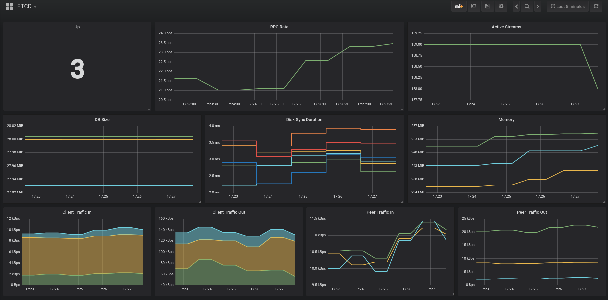
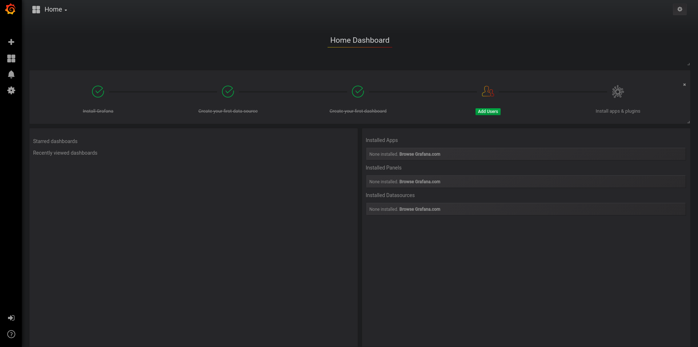
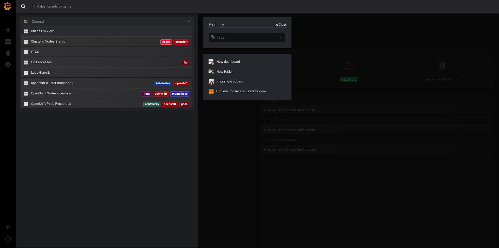
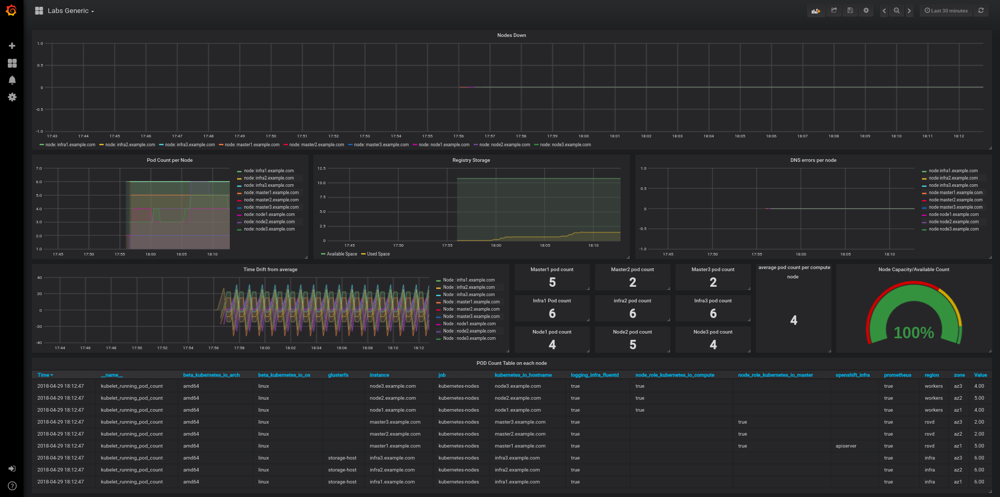
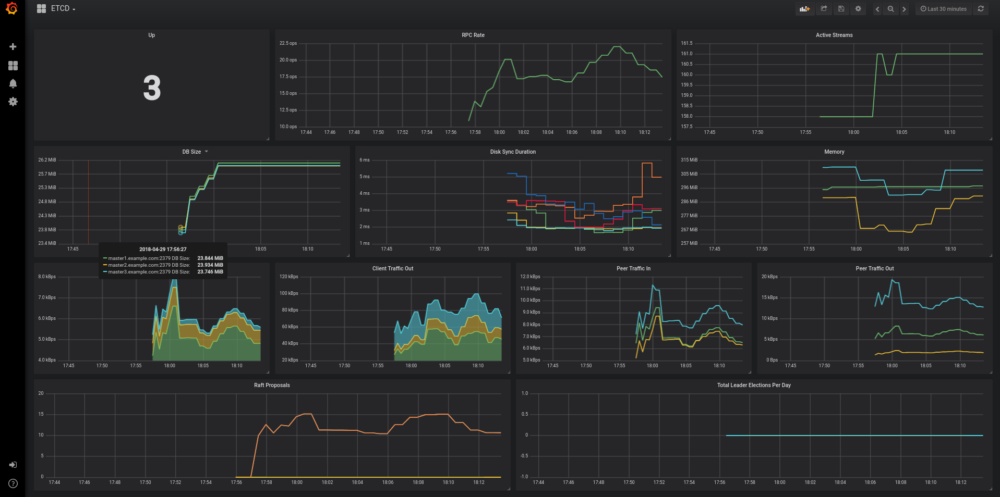
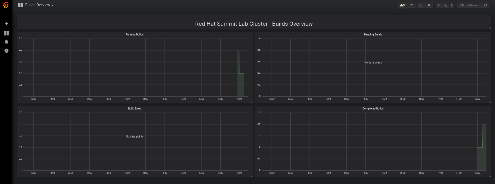

### Overview

This demonstration showcases the following:

  * Debug and recover from OpenShift scheduler issues.
  * Troubleshoot Application Storage issues.
  * Recovering from etcd quorum failures in an operational OpenShift Container Platform cluster.
  * Identify and recover from etcd performance issues.
  * Debug and recover from binary build issues and deployments.
  * Debug and recover from an OpenShift node lost due to SDN issues.
  * Debug and recover an OpenShift node from DNS problems.

#### Goal

* To learn how we can effectively monitor our OpenShift Container Platform (OCP) cluster and proactively solve issues.
* Learn how to debug and operate an OpenShift  Container Platform (OCP) cluster

#### Prerequisites

* Understanding of OpenShift Container Platform (OCP) concepts and working principals.

#### Versions of products used

Product |Version
--------- | ---------
`OpenShift Container Platform` |`3.9`
`Container Native Storage` |`3.3`
`Grafana` |
`Prometheus` |
`Alertmanager` |

### Environment

The demo environment consists of the following systems:


Hostname              |Internal IP    |Description
---------------------- | -------------- | ---------------
`bastion.example.com` |`192.168.0.5`  | Bastion host/Loadbalancer
`master1.example.com`  |`192.168.0.11` | Master 1
`master2.example.com`  |`192.168.0.12` | Master 2
`master3.example.com`  |`192.168.0.13` | Master 3
`infra1.example.com`  |`192.168.0.21` | Infra 1
`infra2.example.com`  |`192.168.0.22` | Infra 2
`infra3.example.com`  |`192.168.0.23` | Infra 3
`node1.example.com`  |`192.168.0.31` | Node 1
`node2.example.com`  |`192.168.0.32` | Node 2
`node3.example.com`  |`192.168.0.33` | Node 3


:green_book: HAProxy is running on the *workstation* machine.  This provides the option to do port forwarding for access to the web console and other services running on the OpenShift Container Platform (this is *one way* to work around DNS and routing limitations in the underlying Ravello environment). Ports included are 80, 8443 and 8080-8085.

#### Links to tools docs used during the Lab

* [Grafana](http://docs.grafana.org/)
* [Prometheus](https://prometheus.io/)
* [Alertmanager](https://prometheus.io/docs/alerting/alertmanager/)
* [Jenkins Monitor](https://wiki.jenkins.io/display/JENKINS/Build+Monitor+Plugin)
* [Skydive](https://skydive-project.github.io/skydive/)

#### Architecture

[](https://rht-labs-events.github.io/summit-lab-2018-doc/labIntro/img/diagram.png)

* You can ssh as `root` from the bastion to any of the OpenShift Container Platform cluster nodes.

* When using ssh to access the lab with the user `lab-user`, it is possible to `sudo -i` to get `root` access.

* The environment contains a few useful applications which will help you in knowing your cluster state.

#### Prometheus

Prometheus will obtain information from endpoints across the environment, and raises alerts based on a set of rules. These alerts are passed to Alertmanager for distribution to dashboards, etc.

[](https://rht-labs-events.github.io/summit-lab-2018-doc/labIntro/img/prometheus.png)


#### Alertmanager

Alertmanager is used to aggregate alerts and dispatch them to the required delivery destination.

[](https://rht-labs-events.github.io/summit-lab-2018-doc/labIntro/img/alertmanager.png)

#### Grafana

Grafana is used to graphically represent cluster data. It interacts directly with Prometheus as its data source.

 [](https://rht-labs-events.github.io/summit-lab-2018-doc/labIntro/img/grafana.png)

Grafana is pre-built with useful dashboards to assist you during the course of this lab. Although not every one of them is needed to finish the lab scenarios, it is highly recommended that you have a closer look at all of them.

The first time you logon to Grafana, you will see a "Home" tab in the top-left corner.

[](https://rht-labs-events.github.io/summit-lab-2018-doc/labIntro/img/grafana-home.png)

If you click on the "Home" tab, a drop-down list with every available dashboard should appear.

[](https://rht-labs-events.github.io/summit-lab-2018-doc/labIntro/img/grafana-dashboards.png)

Below are the 3 Grafana dashboards strictly necessary to finish this lab.

**Labs Generic**

It contains generic information about the cluster such us pod count per node, DNS errors or nodes down.

[](https://rht-labs-events.github.io/summit-lab-2018-doc/labIntro/img/grafana-labs-generic.png)

**ETCD**

`etcd` cluster related information.

[](https://rht-labs-events.github.io/summit-lab-2018-doc/labIntro/img/grafana-etcd.png)


**Builds Overview**

Builds related information.

[](https://rht-labs-events.github.io/summit-lab-2018-doc/labIntro/img/grafana-build-overview.png)

### Getting Started

Open a new web browser window (or tab), then enter the URL below. Use `admin` for the username and `r3dh4t1!` for the password:

* *OpenShift console:* `https://console-<YOUR-GUID>.rhpds.opentlc.com`

:heavy_check_mark: TIP: You can also find these URLs in the email you received when you provisioned the demo environment.


### Review the Environment

Once the OpenShift environment is up and running, log in to the *OpenShift Container Platform Web Console* at `https://console-<YOUR-GUID>.rhpds.opentlc.com/console`.

:heavy_check_mark: TIP: In order to log into the console, use the credentials provided in the lab slides.

:clock10: If nothing is running in the OpenShift Container Platform cluster yet, give it some more time. There is a background service running, which is populating the cluster with content.

### Lab Launcher

The lab is being launched using the command `lab`. This command can only be used from the bastion host.

Example:
```
> lab -l
INFO[0000] Starting Wrapper                             
---------------------------------------------------------------------
Scenario 0
Description: Observe ETCD state and recover when quorum is lost. Simulate 2 DC deployment.
Actions: [init, solve, break1, break2]
To init this scenario execute:
  > lab -s 0 -a init

---------------------------------------------------------------------
Scenario 1
Description: Observe ETCD - Bonus task
Actions: [init, solve]
To init this scenario execute:
  > lab -s 1 -a init
...
```

### CLI access

Once the environment has been successfully bootstrapped, you should see all the welcome screen urls replaced with valid values:
```
Information about Your current environment:
Your GUID: repl
OCP WEB UI access via IP: console.example.com
Wildcard FQDN for apps: apps.example.com

Infrastructure:                                                       
    3 x Masters/Etcd   - master[1-3].example.com                      
    3 x Infra/Gluster  - infra[1-3].example.com                       
    3 x Nodes          - node[1-3].example.com                        

SSH user: root                                                        
Proxy command:                                                        
    ssh -D 8080 -C -N root@workstation-repl.rhpds.opentlc.com                                                                                                      

Pre-Deployed apps:                                                    
    https://prometheus.apps.example.com
    https://grafana.apps.example.com
    https://alertmanager.apps.example.com
```

This information can be recalled at any point by executing: `lab -h`

Initially, there is a set of pre-deployed applications available for your use. Please take a moment to become familiar with what is already there.

Core tools used in this labs are supported by Red Hat. In addition, there are a few non-core ones which are supported by OpenSource communities.

Today's Lab contains a number scenarios. They are all independent, but it is not recommended to jump from one scenario to the next without finishing the previous ones first.

### Info about the scenarios

Every scenario has the following parts:

* `Introduction`: Documentation and explanation of the scenario.
* `Tasks`: Tasks to be performed during the scenario.
* `Solution`: Explanation of the actions that need to be taken to solve the scenario.
* `Appendix`: Materials for further reading.

### [**-- HOME --**](https://rht-labs-events.github.io/summit-lab-2018-doc/)
