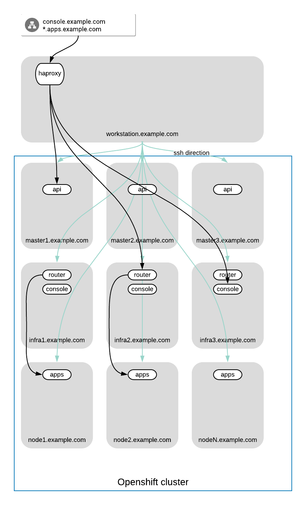
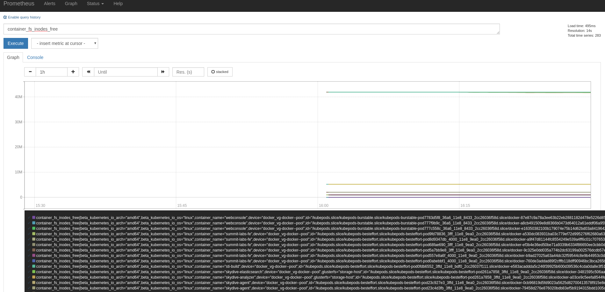
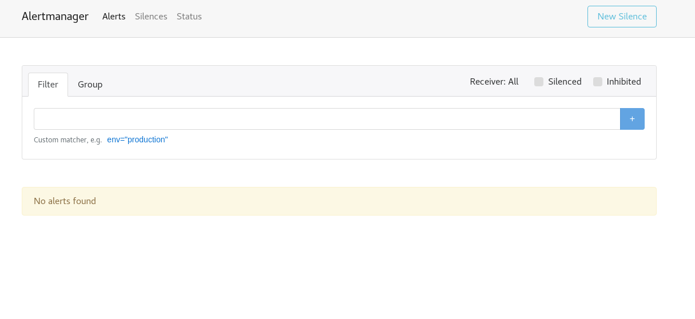

### Overview

This demonstration showcases the following:

* Recovering from etcd failures in a real operational cluster.
* Debug and recovery from failed build due infrastructure and build problems.
* Debug and recover from OpenShift scheduler issues.
* Debug and recover from binary build issues and deployments.
* Debug and recover from an OpenShift node lost.
* Debug and recover a node from DNS problems.

#### Goal

* To learn how we can effectively monitor our OpenShift cluster and proactively solve issues.
* Learn how to debug and operate an OpenShift cluster

#### Prerequisites

* Understanding of OpenShift concepts and working principals.

#### Versions of products used

Product |Version
--------- | ---------
`OpenShift Container Platform` |`3.9`
`Container Native Storate` |`3.3`
`Grafana` |
`Prometheus` |
`Alertmanager` |

### Environment

The demo environment consists of the following systems:


Hostname              |Internal IP    |Description
---------------------- | -------------- | ---------------
`bastion.example.com` |`192.168.0.5`  | Bastion host/Loadbalancer
`master1.example.com`  |`192.168.0.11` | Master 1
`master2.example.com`  |`192.168.0.12` | Master 2
`master3.example.com`  |`192.168.0.13` | Master 3
`infra1.example.com`  |`192.168.0.21` | Infra 1
`infra2.example.com`  |`192.168.0.22` | Infra 2
`infra3.example.com`  |`192.168.0.23` | Infra 3
`node1.example.com`  |`192.168.0.31` | Node 1
`node2.example.com`  |`192.168.0.32` | Node 2
`node3.example.com`  |`192.168.0.33` | Node 3


:green_book: bulb HAProxy is running on the *workstation* machine.  This provides a level of port forwarding to allow access to the OpenShift console and other services running on OpenShift to overcome some DNS and routing limitations in the underlying Ravello environment.  This includes port 80, 8443 and 8080-8085.

#### Links to tools used during the Lab

* [Grafana](https://grafana.apps.example.com/)
* [Prometheus](https://prometheus.apps.example.com/)
* [Alertmanager](https://alertmanager.apps.example.com/)
* [Jenkins Monitor](https://jenkins-ci-cd.apps.example.com/view/summit-labs-fe-monitor/)
* [Skydive](https://skydive.apps.example.com/)

#### Architecture



* You can ssh from bastion to any node from `root` to `root`.

* When you ssh to lab using `lab-user`, you can `sudo su -` to get `root` access.

* Your environment contains few application, which will help you to know your cluster state.

#### Prometheus

Prometheus will scrape endpoints all over the environment and raises the alerts based on rules. Those alerts are passed to Alertmanager for next distribution.




#### Alertmanager

Alertmanager is used to aggregate alerts and dispatch them to the required delivery destination.



#### Grafana

Grafana is used to graphically represent cluster data. It interacts directly with Prometheus as datasource.

 

### Getting Started

From a web browser, open URL below in its own window or tab, using `admin` for the username and `r3dh4t1!` for the password:

* *OpenShift console:* `https://console-<YOUR-GUID>.rhpds.opentlc.com`

:heavy_check_mark: TIP: You can also find these URLs in the email you received when you provisioned the demo environment.


### Review the Environment

Once the OpenShift environment is up and running, log in to the *OpenShift Enterprise Console* at `https://console-<YOUR-GUID>.rhpds.opentlc.com/console`, using these credentials:

* *Username*: `admin`
* *Password*: `r3dh4t1!`

:clock10: If nothing is running on your cluster, give it some time. There is a background service running, which is populating your cluster.

### Lab Launcher

Lab is being launched using command `lab`. It can be used only from the bastion host.

Example:
```
[root@workstation-repl summit]# lab -l
INFO[0000] Starting Wrapper                             
---------------------------------------------------------------------
Scenario 0
Description: Observe ETCD state and recover when quorum is lost. Simulate 2 DC deployment.
Actions: [init, solve, break1, break2]
To init this scenario execute:
  cli -s 0 -a init

---------------------------------------------------------------------
Scenario 1
Description: Observe ETCD - Bonus task
Actions: [init, solve]
To init this scenario execute:
  cli -s 1 -a init
...
```

### CLI access

Once the environment is bootstrapped you should see all the welcome screen url replaces with the values:
```
Information about Your current environment:
Your GUID: repl
OCP WEB UI access via IP: console.example.com
Wildcard FQDN for apps: apps.example.com

Infrastructure:                                                       
    3 x Masters/Etcd   - master[1-3].example.com                      
    3 x Infra/Gluster  - infra[1-3].example.com                       
    3 x Nodes          - node[1-3].example.com                        

SSH user: root                                                        
Proxy command:                                                        
    ssh -D 8080 -C -N root@workstation-repl.rhpds.opentlc.com                                                                                                      

Pre-Deployed apps:                                                    
    https://prometheus.apps.example.com
    https://grafana.apps.example.com
    https://alertmanager.apps.example.com
```

You can get this windows again by executing `lab -h`

You have pre-deployed applications available for you, go and inspect them.

Core tools we will be using in this labs are supported by Red Hat. Few other non-core ones are with community support.

Lab consist of number scenarios. They are independent, but we don't recommend to jump from one scenario to other without finishing previous one.

### Info about the scenarios

Every scenario has the following parts:

* `Introduction`: Documentation and explanation of the scenario.
* `Tasks`: Tasks to be performed during the scenario.
* `Solution`: Explanation of the actions that need to be taken to solve the scenario.
* `Appendix`: Materials for further reading.


### [**-- HOME --**](https://rht-labs-events.github.io/summit-lab-2018-doc/)