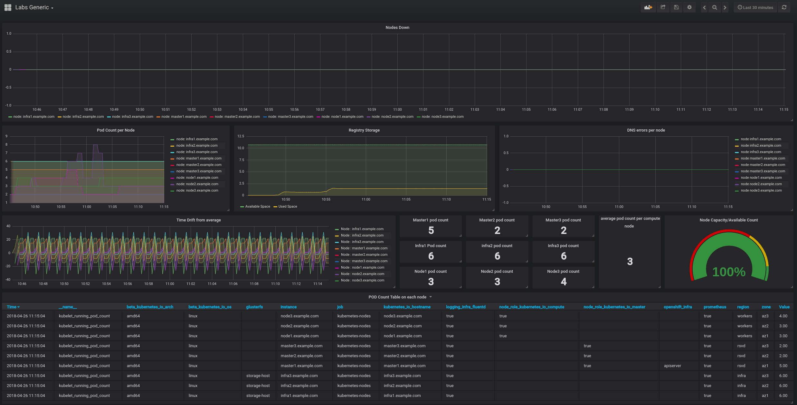
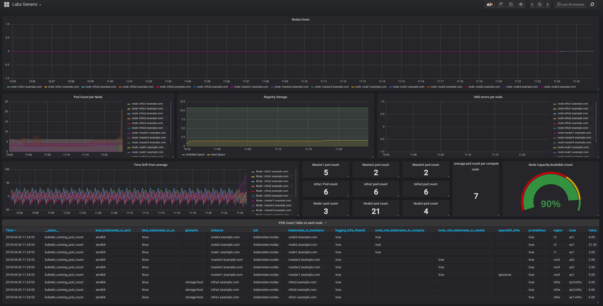
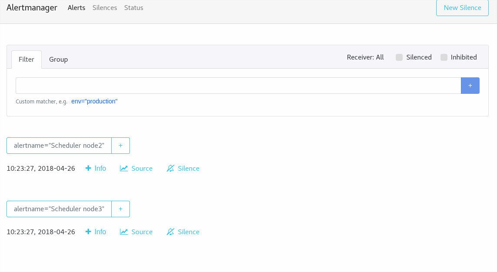
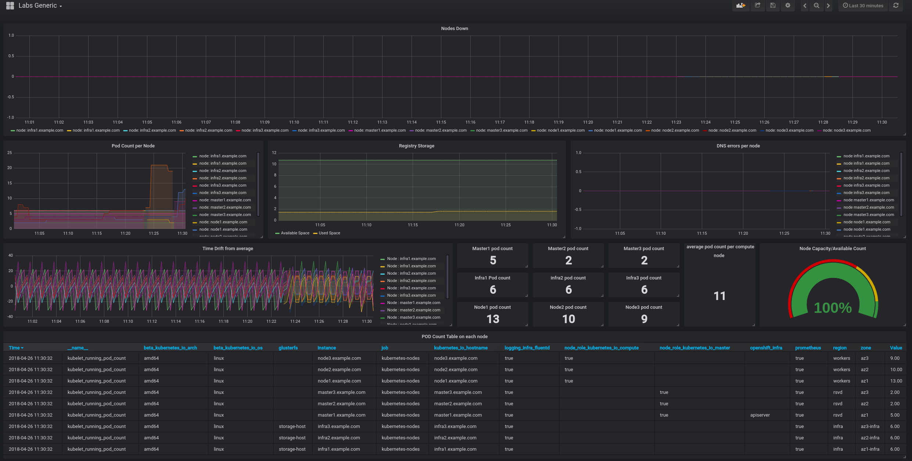

### Problem to solve

```
Complexity: Medium
Length: 10-20 min
Dashboard: Labs Generic
```

In this scenario we will take a closer look at the OpenShift Container Platform scheduler, how limits works, and how it can impact your platforms behaviour and performance. At the end of this scenario, you should have a better understanding of why you should care about the OpenShift Container Platform scheduler.

The Labs Generic dashboard should look something like this:



To start this scenario execute the following command on the bastion:
```
> lab -s 0 -a init
```

Once this completes, a new project should have been created in your cluster named `scheduler`. Please take a moment to become familiar with it.

```
> oc project scheduler
> oc get pods

# output example
> oc get pods
NAME                      READY     STATUS    RESTARTS   AGE
hello-openshift-1-kfgtg   1/1       Running   0          2m
```

Next, scale this app to a replica of 5:
```
> oc scale dc/hello-openshift --replicas=5
```

Everything looks fine at first glance:
```
> oc get pods
NAME                      READY     STATUS    RESTARTS   AGE
hello-openshift-1-5vvj2   1/1       Running   0          23s
hello-openshift-1-9q6jh   1/1       Running   0          23s
hello-openshift-1-f9ngm   1/1       Running   0          23s
hello-openshift-1-kfgtg   1/1       Running   0          3m
hello-openshift-1-krx58   1/1       Running   0          23s
```

But, looking closer at a few more details, you will notice something that is not ideal:
```
> oc get pods -o wide
NAME                      READY     STATUS    RESTARTS   AGE       IP            NODE
hello-openshift-1-9b5gl   1/1       Running   0          21s       10.131.1.29   node2.example.com
hello-openshift-1-hwp9g   1/1       Running   0          31s       10.131.1.28   node2.example.com
hello-openshift-1-kczrg   1/1       Running   0          21s       10.131.1.32   node2.example.com
hello-openshift-1-v6jk5   1/1       Running   0          21s       10.131.1.31   node2.example.com
hello-openshift-1-v9vdt   1/1       Running   0          21s       10.131.1.30   node2.example.com
```

Even though the OpenShift Container Platform consists of multiple application nodes, the pods have not been distributed. Next, add even more replicates to see if the desirable behaviour is reached.

```
> oc scale dc/hello-openshift --replicas=15
```

Still, it's the same result. So what is happening?

First, there is a clear indication that the scheduler does not know how to spread pods over the worker nodes.
Secondly, each pod does not have any limits, so again, scheduler does not know the possible resource consumption of each pod, and hence does not know when node will be full.

At this point, check the dashboards and alerts. As shown below, the node2 pod count is a lot higher than the average (yours might be different). The first graph on row 2 shows the same.


Alert manager should raise an alert for this.


Task 1: Identify why pods are not being balanced across the 3 worker nodes.
For this solution DO NOT modify the default scheduler or the master configuration. Everything should be done at the project level and by utilizing node labeling.

Useful commands:
```
> oc label nodes -l label=value           # label nodes
> oc get nodes --show-labels              # check labels
> cat /etc/origin/master/scheduler.json   # check scheduler
> oc edit namespace scheduler             # modify namespace
```

### Solution

Next, let us see how we can obtain the necessary information to identify the cause. First, retrieve the the labels assigned to the worker nodes:
```
> oc get nodes --show-labels
 :
node1.example.com     Ready                      7d        v1.7.6+a08f5eeb62   ...,region=r1,zone=az1
node2.example.com     Ready                      7d        v1.7.6+a08f5eeb62   ...,region=r2,zone=az1
node3.example.com     Ready                      7d        v1.7.6+a08f5eeb62   ...,region=r3,zone=az1
```

As shown above, the nodes have been assigned the same zone, but different regions. Next, check the default node-selector for the project:
```
> oc get project scheduler -o yaml
  :
    openshift.io/node-selector: zone=az1
  :

```

Based on this, the scheduler should evenly spread the pods on all the worker nodes. But, as seen above, it does not. The next place to check,  might be the overall node utilisations.
```
> oc describe node node1.example.com
 :
Capacity:
 cpu:           8
 memory:        8009640Ki
 pods:          254
Allocatable:
 cpu:           7
 memory:        5097013760
 pods:          254

 :

Non-terminated Pods:                    (5 in total)
  Namespace                             Name                                    CPU Requests    CPU Limits      Memory Requests Memory Limits
  ---------                             ----                                    ------------    ----------      --------------- -------------
  coolstore                             cart-1-865sr                            0 (0%)          0 (0%)          200Mi (4%)      1Gi (21%)
  coolstore                             inventory-1-nqhpc                       0 (0%)          0 (0%)          512Mi (10%)     1Gi (21%)
  coolstore                             rating-mongodb-1-deploy                 0 (0%)          0 (0%)          0 (0%)          0 (0%)
  coolstore                             web-ui-1-ch4ff                          0 (0%)          0 (0%)          0 (0%)          0 (0%)
  openshift-metrics-node-exporter       prometheus-node-exporter-j64wz          100m (1%)       200m (2%)       30Mi (0%)       50Mi (1%)
Allocated resources:
  (Total limits may be over 100 percent, i.e., overcommitted.)
  CPU Requests  CPU Limits      Memory Requests Memory Limits
  ------------  ----------      --------------- -------------
  100m (1%)     200m (2%)       742Mi (15%)     2098Mi (43%)
Events:         <none>

```

Again, based on this output, it is clear that `node1` is not highly utilized, and there are resources available in the `Allocatable` section.

*Tip:* It is worth mentioning that `QoS` is active and you should be aware about how it works. It is recommended that you read the following page at your own leisure: https://blog.openshift.com/managing-compute-resources-openshiftkubernetes/

If `oc describe node` is done on the node where all of the `hello-openshift` pods are running, it indicates that the pods have no limits and quotas:
```
  scheduler                             hello-openshift-1-28rbl                 0 (0%)          0 (0%)          0 (0%)          0 (0%)
  scheduler                             hello-openshift-1-4dsnb                 0 (0%)          0 (0%)          0 (0%)          0 (0%)
  scheduler                             hello-openshift-1-7l7bv                 0 (0%)          0 (0%)          0 (0%)          0 (0%)
  scheduler                             hello-openshift-1-86s6g                 0 (0%)          0 (0%)          0 (0%)          0 (0%)
  scheduler                             hello-openshift-1-8828n                 0 (0%)          0 (0%)          0 (0%)          0 (0%)
  scheduler                             hello-openshift-1-8d6lj                 0 (0%)          0 (0%)          0 (0%)          0 (0%)
  scheduler                             hello-openshift-1-8lgvb                 0 (0%)          0 (0%)          0 (0%)          0 (0%)
  scheduler                             hello-openshift-1-bdmtj                 0 (0%)          0 (0%)          0 (0%)          0 (0%)
  scheduler                             hello-openshift-1-bnjmw                 0 (0%)          0 (0%)          0 (0%)          0 (0%)
```

The above mentioned blog post describes how to manage compute resources. Based on the defined QoS Tiers, and the fact that these pods are running with requests and limits of 0, they are running at a `Best-Effort` QoS. This is not good, but it is outside of the scope of this scenario to solve this. The focus is to figure out why the pods are not balanced across all of the worker nodes.

Last place to check is the Kubernetes scheduler:

Start by using ssh to access any of the masters, and check the scheduler file:
```
> ssh master1.example.com
> cat /etc/origin/master/scheduler.json
{
    "apiVersion": "v1",
    "kind": "Policy",
    "predicates": [
       ....
        {
            "argument": {
                "serviceAffinity": {
                    "labels": [
                        "region"
                    ]
                }
            },
            "name": "Region"
        }
    ],
    "priorities": [
      ...
        {
            "argument": {
                "serviceAntiAffinity": {
                    "label": "zone"
                }
            },
            "name": "Zone",
            "weight": 2
        }
    ]
}
```

*More on the scheduler configuration can be found in the OpenShift Container Platform documentation[1].*

Based on the above output, and the fact that the nodes in the OpenShift Container Platform cluster have labels `zone=az1` and `region=r1|r2|r3`, the scheduler is doing the following:
* `serviceAntiAffinity` based on `zone` label: try to spread pods as much as you can within the zone.
* `serviceAffinity` based on `region` label: try to keep all pods as close as possible within region.

Those rules are not "hard" rules if limits and quotas are set. In that case, the scheduler knows when a node is full, and can schedule pods to other nodes.

As another attempt to correct how the pods are scheduled, the default scheduler should not be changed as it could impact other applications running on the platform. Instead, let us attempt to change the nodes labels to correct the placement of the pods.

First relabel the worker nodes:
```
> oc label nodes node1.example.com region=workers --overwrite
> oc label nodes node2.example.com region=workers --overwrite
> oc label nodes node3.example.com region=workers --overwrite
> oc label nodes node1.example.com zone=az1 --overwrite
> oc label nodes node2.example.com zone=az2 --overwrite
> oc label nodes node3.example.com zone=az3 --overwrite
```

Next, remove the default node selector from the project as this is no longer needed:

```
> oc edit namespace scheduler
# remove line
 :
openshift.io/node-selector: zone=az1
 :
```

If a default node selector is not defined at the project level, it will use the one from the openshift master config:
```
> ssh master1.example.com
> cat /etc/origin/master/master-config.yaml | grep defaultNodeSelector
  defaultNodeSelector: region=workers
```

Now delete the pods and check again:

```
> oc project scheduler
> oc delete pod --all
```

After the old pods have been deleted, and new ones created, check the placement again:
```
> oc get pods -o wide
```
At this point, the placement should show a utilization of all 3 nodes because `serviceAntiAffinity` is based on zone label, so scheduler is trying to balance pod placement across all matching nodes.

The dashboard should now be back to normal:


When you done with the scenario, execute the following command on the  bastion host:

```
> lab -s 0 -a solve
```

### Appendix

#### Materials used in the scenario

1. Openshift Scheduler explained:
https://docs.openshift.com/container-platform/3.9/admin_guide/scheduling/scheduler-advanced.html#admin-guide-scheduling-advanced

2. OpenShift Resource managment:
https://blog.openshift.com/managing-compute-resources-openshiftkubernetes/


### [**-- HOME --**](https://rht-labs-events.github.io/summit-lab-2018-doc/)
