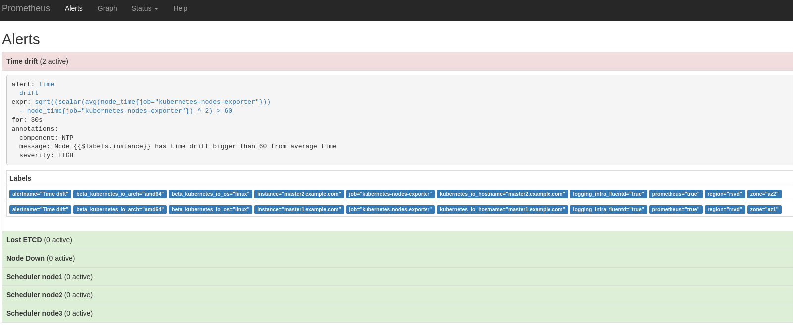

# Recovery

## Task 3 solution

This scenario is one the most common issue we see. Distributed systems are very sensitive to time drifts. Even slight time difference can impact all platform performance. This is because one of the metrics, when agreeing on state is time.

### Check time on all etcd nodes

Execute from the bastion:
```
[root@workstation-repl summit]# ansible etcd -m shell -a "date"
master2.example.com | SUCCESS | rc=0 >>
Mon Mar 26 07:39:17 EDT 2018

master3.example.com | SUCCESS | rc=0 >>
Mon Mar 26 07:40:57 EDT 2018

master1.example.com | SUCCESS | rc=0 >>
Mon Mar 26 07:42:36 EDT 2018
```

This is far from reliable data, but we can see already that time difference is huge. We can see same in grafana:


Because we are running isolated system, our time drift is calculated based on average of all infrastructure. In the real world you would need external NTP server to check for the time.

We should see alert for this too:



Solution is very simple: 

Check if time keeping service is running:
```
ansible etcd -m shell -a "systemctl status chronyd"
```

Start the service:
```
ansible etcd -m shell -a "systemctl start chronyd"
```

Force time sync:
```
ansible etcd -m shell -a "chronyc -a 'burst 4/4' && chronyc -a makestep"
```

Alerts should become inactive, and grafana shows new state:


[instructions Task 1](part1.md)

[lab Intro](../README.md)

[appendix](appendix.md)

[next lab](../scenario2/part1.md)