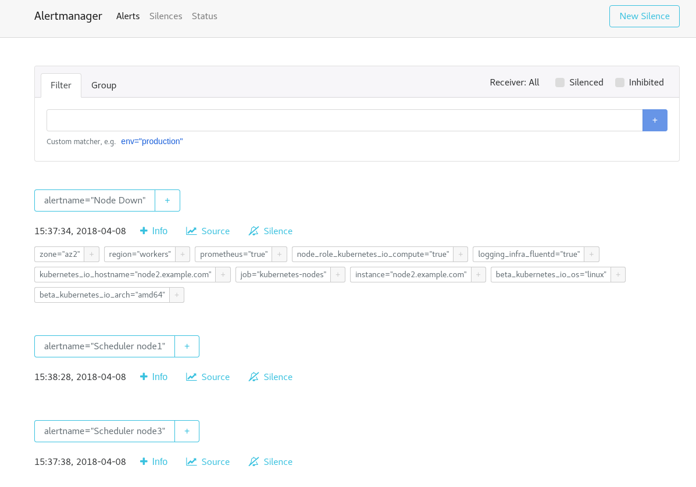
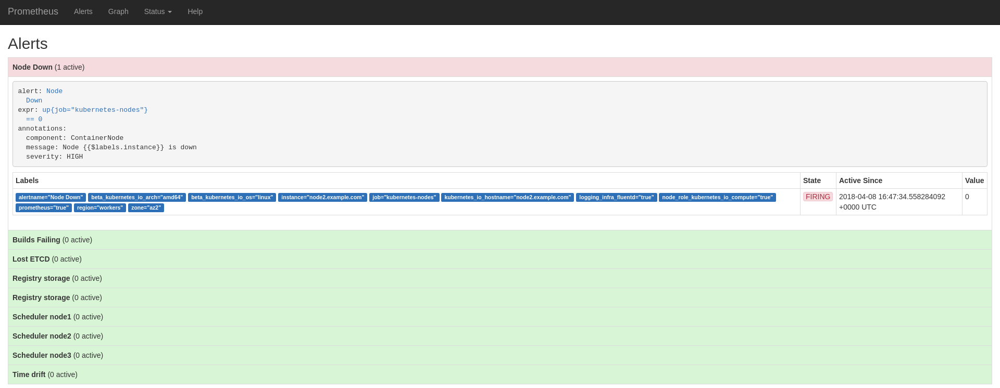

### Problem to solve

```
Complexity: Low
Lenght: 10 min
Dashboards: Labs Generic
```

In this lab we will see how OpenShift behaves when losing connectivity to a node due to a SDN problem.

You should see something like this in the `Labs Generic` Grafana dashboard:


To start the scenario:
```
lab -s 5 -a init
```

Try to guess what would happen, so at the end of the scenario you could validate if your reasoning was right or wrong ;).

As a bonus, you will be introduced to SkyDive tool:

* An open source real-time network topology and protocols analyzer.  It aims to provide a comprehensive way of understanding what is happening in the network infrastructure.

* The aim of using SkyDive in this scenario is to give you the opportunity to visualize OpenShift SDN and a better understanding of how it works.

* You could see all SDN pieces working together: pods, containers, namespaces, virtual switches, interfaces, etc.

SkyDive console is pretty cool. Get the route to the console from `skydive` namespace:

```
oc -n skydive get route
NAME               HOST/PORT                                             PATH      SERVICES           PORT      TERMINATION   WILDCARD
skydive-analyzer   skydive-analyzer-skydive.apps.129.213.76.166.xip.io             skydive-analyzer   api                     None
```

:heavy_check_mark: Skydive is exposed in port 80, so use http to access the route instead of https.**


#### Lab Goal:

**You can spend 1 or 2 minutes checking SkyDive console, just to see all SDN pieces working together.**

**You won't need SkyDive to solve this scenario though ;). It is just a visualization tool.**


* Task 1: Identify why one of your nodes is down. Identify which one. Use Grafana dashboard `Labs Generic` and Alertmanager.

* Task 2: Make your node ready again. It seems like a connectivity problem, right? Try to start the service `atomic-openshift-node` and see what happens.

* Hint 1: openvswitch is a key component of the OpenShift SDN.


If you want to skip these task, execute on the <b>bastion</b>
```
 lab -s 5 -a solve
```

Useful command for this lab:

```
journalctl -fu <service_name> - follow logs of the service
oc get nodes
oc describe node <node_nae>
```

### Solution

#### Task 1 solution: Identify node down

Nodes (atomic-openshift-node/kubelet) sends heartbeats periodically to the API. Thats how a node reports its status to the cluster. Healthy nodes should be in `Ready` status.

You can check your cluster nodes by executing `oc get nodes`. You can check one particular node by running `oc describe node <OCP_NODE>` to one of the nodes of your cluster. Actually this command gives you a lot more information of the node.

Here it is the example output of the node, expect to see something similar:

```
oc describe node node2.example.com
Name:               node2.example.com                                                                                                                                                                                
Roles:              compute                                                                                                                                                                                          
Labels:             beta.kubernetes.io/arch=amd64                                                                                                                                                                    
                    beta.kubernetes.io/os=linux                                                                                                                                                                      
                    kubernetes.io/hostname=node2.example.com                                                                                                                                                         
                    logging-infra-fluentd=true                                                                                                                                                                       
                    node-role.kubernetes.io/compute=true                                                  
                    prometheus=true                  
                    region=workers                   
                    zone=az2                         
Annotations:        volumes.kubernetes.io/controller-managed-attach-detach=true                           
Taints:             <none>                           
CreationTimestamp:  Sat, 31 Mar 2018 05:20:48 -0400  
Conditions:                                          
  Type             Status  LastHeartbeatTime                 LastTransitionTime                Reason                       Message                                                                                  
  ----             ------  -----------------                 ------------------                ------                       -------                                                                                  
  OutOfDisk        False   Sat, 07 Apr 2018 09:10:47 -0400   Sat, 07 Apr 2018 07:02:45 -0400   KubeletHasSufficientDisk     kubelet has sufficient disk space available                                              
  MemoryPressure   False   Sat, 07 Apr 2018 09:10:47 -0400   Sat, 07 Apr 2018 07:02:45 -0400   KubeletHasSufficientMemory   kubelet has sufficient memory available                                                  
  DiskPressure     False   Sat, 07 Apr 2018 09:10:47 -0400   Sat, 07 Apr 2018 07:02:45 -0400   KubeletHasNoDiskPressure     kubelet has no disk pressure                                                             
  Ready            True    Sat, 07 Apr 2018 09:10:47 -0400   Sat, 07 Apr 2018 07:02:55 -0400   KubeletReady                 kubelet is posting ready status                          
```

Although you should already know which node is down, you should also check Grafana, Prometheus and Alertmanager to get more info.

So open Grafana dashboard `Labs Generic` and check the `Nodes Down` panel.

You should see something like this:


Now check both Prometheus and Alertmanager. You should have alerts in both:



Note that apart from the "Node Down" alert you have two scheduler related alerts. The reason is that nodes 1 & 3 have more Pods than they should, as the Pods from node 2 have been re-scheduled into those nodes.

This a configured alert to raise un-even Pod distribution situations in your cluster nodes ;).



Now that we now that node 2 is down, we have to discover what is not working properly.

Let's ssh into it, and check the status of the `atomic-openshift-node`:

```
ssh node2.example.com
systemctl status atomic-openshift-node
```

As you can see, the service is stopped. Let's check  also the `openvswitch` service:

```
ssh node2.example.com
systemctl status openvswitch
```

We can see is stopped too.

#### Task 2 solution: Make node ready again

Now that we know what is happening, start `atomic-openshift-node` service again.

```
systemctl start atomic-openshift-node
```

There is no need to start each service independently. Actually `atomic-openshift-node` systemd unit has `openvswitch` as one of its dependencies, so when `atomic-openshift-node` is started, `openvswitch` service is started too.

You can check that `openvswitch` service is already running after starting `atomic-openshift-node`.

 ```
systemctl status openvswitch
● openvswitch.service
   Loaded: loaded (/etc/systemd/system/openvswitch.service; enabled; vendor preset: disabled)
  Drop-In: /etc/systemd/system/openvswitch.service.d
           └─01-avoid-oom.conf
   Active: active (running) since Thu 2018-04-19 12:33:27 EDT; 2min 38s ago
  Process: 2125 ExecStartPost=/usr/bin/sleep 5 (code=exited, status=0/SUCCESS)
  Process: 2110 ExecStartPre=/usr/bin/docker rm -f openvswitch (code=exited, status=1/FAILURE)
 Main PID: 2124 (docker-current)
    Tasks: 12
   Memory: 2.0M
   CGroup: /system.slice/openvswitch.service
           └─2124 /usr/bin/docker-current run --name openvswitch --rm --privileged --net=host --pid=host -v /lib/modules:/lib/modules -v /run:/run -v /sys:/sys:ro -v /etc/origin/openvswitch:/etc/openvswitch ope...

Apr 19 12:33:22 node1.example.com systemd[1]: Starting openvswitch.service...
Apr 19 12:33:22 node1.example.com openvswitch[2110]: Error response from daemon: No such container: openvswitch
Apr 19 12:33:27 node1.example.com systemd[1]: Started openvswitch.service.
Apr 19 12:33:49 node1.example.com openvswitch[2124]: Starting ovsdb-server [  OK  ]
Apr 19 12:33:50 node1.example.com openvswitch[2124]: Configuring Open vSwitch system IDs [  OK  ]
Apr 19 12:33:50 node1.example.com openvswitch[2124]: Inserting openvswitch module [  OK  ]
Apr 19 12:33:51 node1.example.com openvswitch[2124]: Starting ovs-vswitchd [  OK  ]
Apr 19 12:33:52 node1.example.com openvswitch[2124]: Enabling remote OVSDB managers [  OK  ]
```

Check again Grafana, Prometheus and Alertmanager. You should not see any alerts.

:heavy_check_mark: Alertmanager alerts usually take a while to disappear, so expect around 5-10 min delay.**

### OVS Deep dive

All traffic in the OpenShift OVS based plugins can be inspected even more. On a node of your choice execute:

```
docker exec openvswitch ovs-ofctl -O OpenFlow13 dump-flows br0
```

You should see all flows for this particular node:
```
OFPST_FLOW reply (OF1.3) (xid=0x2):
 cookie=0x0, duration=578.553s, table=0, n_packets=0, n_bytes=0, priority=250,ip,in_port=2,nw_dst=224.0.0.0/4 actions=drop

 cookie=0x0, duration=578.521s, table=10, n_packets=0, n_bytes=0, priority=0 actions=drop
 cookie=0x0, duration=158.408s, table=20, n_packets=0, n_bytes=0, priority=100,arp,in_port=73,arp_spa=10.129.2.132,arp_sha=00:00:0a:81:02:84/00:00:ff:ff:ff:ff actions=load:0x135688->NXM_NX_REG0[],goto_table:21
 cookie=0x0, duration=578.446s, table=30, n_packets=0, n_bytes=0, priority=25,ip,nw_dst=224.0.0.0/4 actions=goto_table:110
 cookie=0x0, duration=578.424s, table=40, n_packets=0, n_bytes=0, priority=0 actions=drop
 cookie=0x0, duration=577.587s, table=50, n_packets=0, n_bytes=0, priority=100,arp,arp_tpa=10.129.0.0/23 actions=move:NXM_NX_REG0[]->NXM_NX_TUN_ID[0..31],set_field:192.168.0.12->tun_dst,output:1
 cookie=0x0, duration=578.418s, table=50, n_packets=0, n_bytes=0, priority=0 actions=drop
 cookie=0x0, duration=578.412s, table=60, n_packets=0, n_bytes=0, priority=200,reg0=0 actions=output:2
 cookie=0x0, duration=577.758s, table=60, n_packets=0, n_bytes=0, priority=100,ip,nw_dst=172.30.49.239,nw_frag=later actions=load:0->NXM_NX_REG1[],load:0x2->NXM_NX_REG2[],goto_table:80
 cookie=0x0, duration=578.406s, table=60, n_packets=0, n_bytes=0, priority=0 actions=drop
 cookie=0x0, duration=158.385s, table=70, n_packets=0, n_bytes=0, priority=100,ip,nw_dst=10.129.2.132 actions=load:0x135688->NXM_NX_REG1[],load:0x49->NXM_NX_REG2[],goto_table:80
 cookie=0x0, duration=578.393s, table=80, n_packets=0, n_bytes=0, priority=300,ip,nw_src=10.129.2.1 actions=output:NXM_NX_REG2[]
 cookie=0x0, duration=578.369s, table=101, n_packets=0, n_bytes=0, priority=51,tcp,nw_dst=192.168.0.32,tp_dst=53 actions=output:2
 cookie=0x0, duration=578.365s, table=101, n_packets=0, n_bytes=0, priority=51,udp,nw_dst=192.168.0.32,tp_dst=53 actions=output:2
 cookie=0x0, duration=578.356s, table=101, n_packets=0, n_bytes=0, priority=0 actions=output:2
```

Rules are complicated. But what you need to know is the high level structure of the tables.

Some of the rules:

```
Table 10: VXLAN ingress filtering; filled in by AddHostSubnetRules()
Table 21: from OpenShift container; NetworkPolicy plugin uses this for connection tracking
Table 30: general routing
Table 40: ARP to local container, filled in by setupPodFlows
Table 101: egress network policy dispatch; edited by UpdateEgressNetworkPolicy()
```

Sometimes you can observe a misbehavior, lets say EgressNetworkPolicy does not work as you expect or you think it does not work as you expect. By knowing how to dump rules, and where to look you can validate your doubts.

### Appendix

#### Materials used in the scenario

1. OpenShift SDN Docs:
https://docs.openshift.com/container-platform/3.9/architecture/networking/sdn.html

2. SkyDive Docs:
http://skydive-project.github.io/skydive/

3. Code documentation of OVS rules:
https://github.com/openshift/origin/blob/c3d0a824b503091f5aa81c88954f218c8f6d6937/pkg/network/node/ovscontroller.go


### [**-- HOME --**](https://rht-labs-events.github.io/summit-lab-2018-doc/)