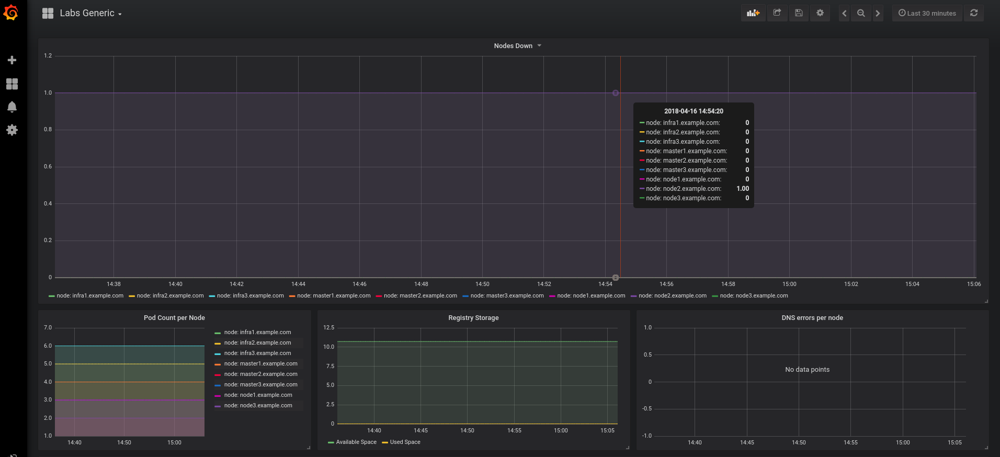
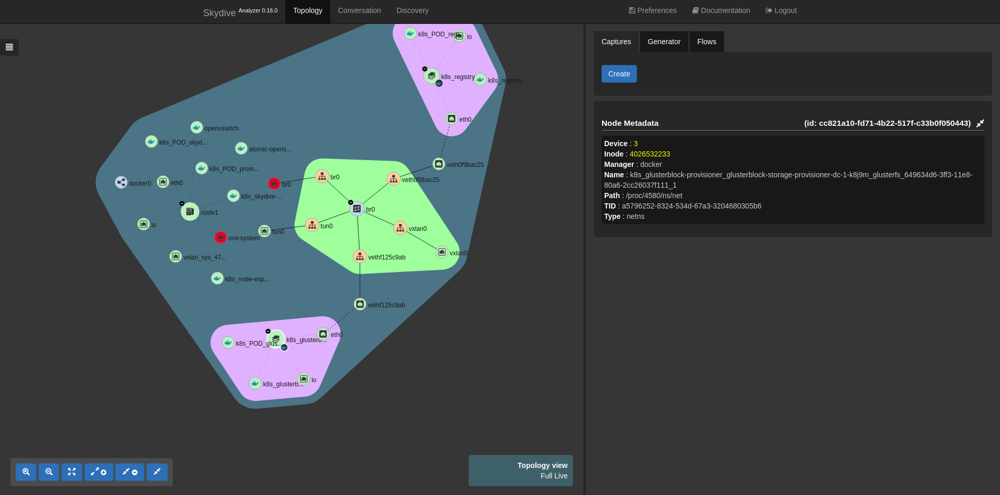

# Scenario 5 - SDN/Node Lost

```
Complexity: Low
Lenght: 10 min
Dashboards: Labs Generic
```

In this lab we will see how OpenShift behaves when losing connectivity to a node due to a SDN problem.

You should see something like this in the `Labs Generic` Grafana dashboard:



Try to guess what would happen, so at the end of the scenario you could validate if your reasoning was right or wrong ;).

As a bonus, you will be introduced to SkyDive tool:

* An open source real-time network topology and protocols analyzer.  It aims to provide a comprehensive way of understanding what is happening in the network infrastructure.

* The aim of using SkyDive in this scenario is to give you the opportunity to visualize OpenShift SDN and a better understanding of how it works. 

* You could see all SDN pieces working together: pods, containers, namespaces, virtual switches, interfaces, etc.

SkyDive console is pretty cool:




To start the scenario:
```
lab -s 5 -a init
```

## Lab Goal:

<b>You can spend 1 or 2 minutes checking SkyDive console, just to see all SDN pieces working together.

You won't need SkyDive to solve this scenario though ;). It is just a visualization tool. 
</b>

* Task 1: Identify why one of your nodes is down. Identify which one. Use Grafana dashboard `Labs Generic` and alert manager.

* Task 2: Make your node ready again. It seems like a connectivity problem, right? Try to start the service `atomic-openshift-node` and see what happens.

* Hint 1: openvswitch is a key component of the OpenShift SDN.


If you want to skip these task, execute on the <b>bastion</b>
```
 lab -s 5 -a solve
```

Useful command for this lab:

```
journalctl -fu <service_name> - follow logs of the service
oc get nodes 
oc describe node <node_nae>
```

[solution Task 1](solution_part1.md)

[lab intro](../README.md)

[appendix](appendix.md)

[next lab](../scenario6/part1.md)