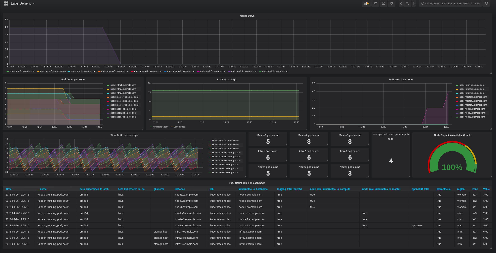
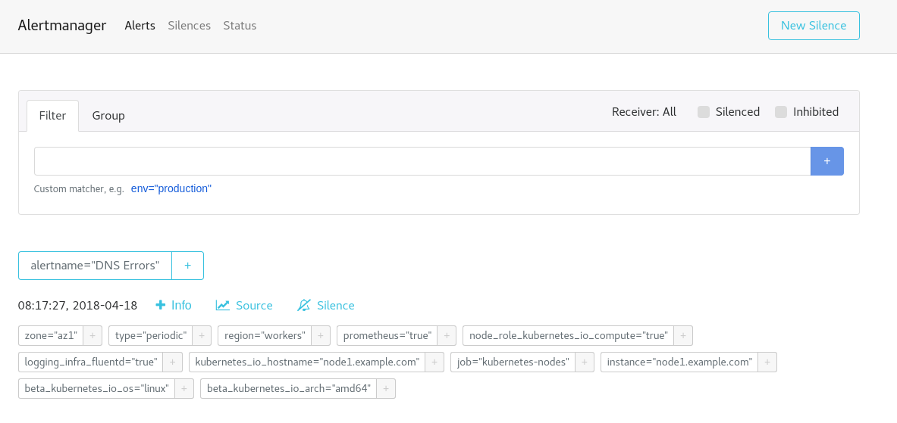

### Problem to solve

```
Complexity: Low
Lenght: 15 min
Dashboards: Labs Generic
```

### Intro

In this lab scenario we will simulate a common problem usually found in customer deployments - DNS problems ;).
Applications are very sensitive to DNS resolution issues, which can be tough to troubleshoot.

If you want to know how DNS configuration works in the OpenShift Container Platform, take a closer look at the following  [article](https://www.redhat.com/en/blog/red-hat-openshift-container-platform-dns-deep-dive-dns-changes-red-hat-openshift-container-platform-36).

The following is the DNS architecture diagram for an OpenShift Container Platform node:


A tricky thing about DNS problems, as you may already know, is that your OpenShift Container Platform cluster may operate just fine, while the  applications might not.

To start the scenario:
```
> lab -s 6 -a init
```

#### Lab Goal:

* Task 1: Identify which node is impacted and why.

* Task 2: Identify which component or components are impacted. Fix it ;)

* *Hint 1*: dnsmasq is a key component of the OpenShift Container Platform DNS architecture.


If you want to skip this task, execute on the <b>bastion</b>:
```
> lab -s 6 -a solve
```

Useful commands for this lab:

```
> systemctl status/stop <service_name>
> journalctl -fu <service_name> - follow logs of the service
> oc get nodes
> dig
> ss -ntlp
```

### Solution

#### Task 1 solution: Identify which node is impacted, and why.

At first sight, all of the OpenShift Container Platform nodes are fine. Running the command `oc get nodes` yields nothing wrong.

Checking the monitoring tools, Grafana, Prometheus and Alertmanager, will potentially show more info. Open Grafana dashboard `Labs Generic` and check the `DNS errors per node` panel.

Something like the following in the `Labs Generic` Grafana dashboard (DNS errors per node graph) should be displayed:



This Grafana panel gives you enough information to know which node is having DNS problems, but it is also good to check Prometheus and Alertmanager as well.

Both should show alerts:




Now that it is clear that node 1 is impacted, the next step is to identify what is broken.

#### Task 2 solution: Identify which component or components are impacted. Fix it.

Use ssh to access the node, and check the DNS resolution (keeping in mind to the diagram above). First, try to resolve the Kubernetes api service `kubernetes.default.svc.cluster.local` and examine the result.

The DNS resolution in this case happens by first consulting the embedded SkyDNS in the OpenShift node service (127.0.0.1:53) and next the dnsmasq service (<node_ip>:53).

```
> ssh node1.example.com

> dig @127.0.0.1 kubernetes.default.svc.cluster.local +short
172.30.0.1
```

The result shows that SkyDNS is resolving properly. Next, check dnsmasq. Get node ip:

```
> ip a s eth0
2: eth0: <BROADCAST,MULTICAST,UP,LOWER_UP> mtu 1500 qdisc pfifo_fast state UP qlen 1000
    link/ether 2c:c2:60:0a:fc:82 brd ff:ff:ff:ff:ff:ff
    inet 192.168.0.31/16 brd 192.168.255.255 scope global dynamic eth0
       valid_lft 341277sec preferred_lft 341277sec
    inet6 fe80::2ec2:60ff:fe0a:fc82/64 scope link
       valid_lft forever preferred_lft forever

```

Check dnsmasq:

```
> dig @192.168.0.31 kubernetes.default.svc.cluster.local +short
.... (nothing)
```

`dnsmasq` is not even responding, so check the status of the service.

```
> systemctl status dnsmasq
● dnsmasq.service - DNS caching server.
   Loaded: loaded (/usr/lib/systemd/system/dnsmasq.service; enabled; vendor preset: disabled)
   Active: inactive (dead) since Wed 2018-04-18 04:15:54 EDT; 4h 41min ago
  Process: 1056 ExecStart=/usr/sbin/dnsmasq -k (code=exited, status=0/SUCCESS)
 Main PID: 1056 (code=exited, status=0/SUCCESS)

Apr 18 03:57:31 node1.example.com dnsmasq[1056]: using nameserver 127.0.0.1#53 for domain cluster.local
Apr 18 03:57:33 node1.example.com dnsmasq[1056]: setting upstream servers from DBus
Apr 18 03:57:33 node1.example.com dnsmasq[1056]: using nameserver 127.0.0.1#53 for domain cluster.local
Apr 18 03:57:33 node1.example.com dnsmasq[1056]: using nameserver 127.0.0.1#53 for domain in-addr.arpa
Apr 18 03:57:33 node1.example.com dnsmasq[1056]: using nameserver 192.168.0.1#53
Apr 18 03:57:33 node1.example.com dnsmasq[1056]: using nameserver 127.0.0.1#53 for domain in-addr.arpa
Apr 18 03:57:33 node1.example.com dnsmasq[1056]: using nameserver 127.0.0.1#53 for domain cluster.local
Apr 18 04:15:54 node1.example.com systemd[1]: Stopping DNS caching server....
Apr 18 04:15:54 node1.example.com dnsmasq[1056]: exiting on receipt of SIGTERM
Apr 18 04:15:54 node1.example.com systemd[1]: Stopped DNS caching server..
```

The `dnsmasq` service was stopped. Start it and check the DNS resolution again.

```
> systemctl start dnsmasq

> dig @192.168.0.31 kubernetes.default.svc.cluster.local +short
172.30.0.1
```

Next, check Grafana, Prometheus and Alertmanager again - at this point there should be no more alerts.

:heavy_check_mark: Alertmanager alerts usually take a while to disappear, so expect around 5-10 minutes for everything to clear.

### Appendix

#### Materials used in the scenario

1. OpenShift DNS Docs:
https://docs.openshift.com/container-platform/3.9/architecture/networking/networking.html#architecture-additional-concepts-openshift-dns

2. OpenShift DNS Deep dive:
https://www.redhat.com/en/blog/red-hat-openshift-container-platform-dns-deep-dive-dns-changes-red-hat-openshift-container-platform-36


### [**-- HOME --**](https://rht-labs-events.github.io/summit-lab-2018-doc/)
